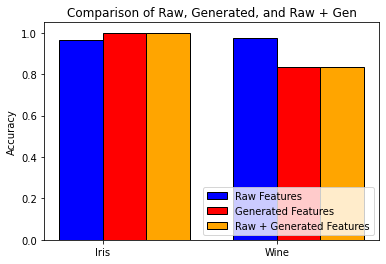

# Feature-generation-using-Transformers

The `TransformerModel` is composed of three main components:

The `pos_encoder` is a sequence of two linear layers that maps the input tensor `x` to a higher-dimensional space called the model dimension `d_model`. It also applies a ReLU activation function after the first linear layer.

The `transformer_encoder` is an instance of the `nn.TransformerEncoder` class, which is a sequence of 4 transformer encoder layers. Each transformer encoder layer consists of a multi-head self-attention mechanism followed by a position-wise feedforward network. The output of the transformer encoder is a tensor with the same shape as the input tensor.

The `decoder` is a single linear layer that maps the output of the transformer encoder to the output tensor `y`.

Finally, the `forward` method applies each of these three components in order to compute the output tensor `y` from the input tensor `x`.

The model uses the Rectified Linear Unit (ReLU) activation function after the first linear layer and the Cross-Entropy Loss function for classification. It is trained using the Adam optimizer with a learning rate of 0.0001 over 100 epochs and a batch size of 16.

